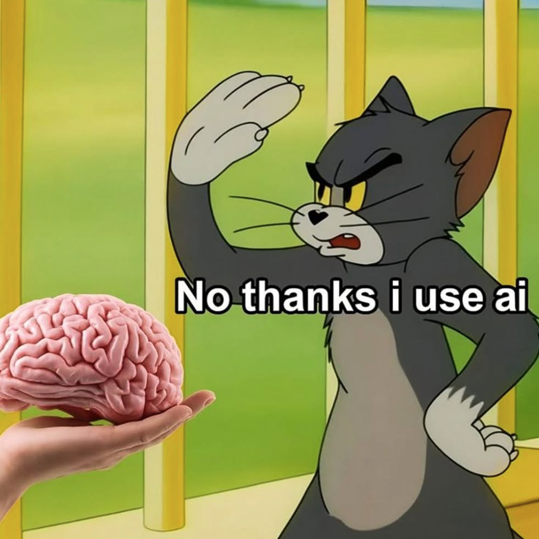

# Advancing in the Harness: Beyond Basic Claude Code — Workshop 3 (Crazy Town)

This is the third and final workshop in the Agentic Programming series, building on the foundations laid in the first two sessions, 1) Agentic AI in a Programmatic Way and 2) Beyond Vibe Coding. In this hands-on workshop we'll recap Claude Code essentials like sub-agents and custom skills, and go deeper into Model Context Protocol (MCP) and how it connects to skills and custom commands. We'll explore useful agent configuration files like AGENTS.md, and learn to use plan mode and planning agents to deploy multiple agents in parallel. To close, participants will build an AI-native project, putting the main concepts into practice.

No prior Claude Code subscription needed. An API key will be provided during the workshop.

> Continuation of Workshops 1 & 2. Theme of WS3: **giving the agent capabilities (MCP), packaging know‑how (Skills), memory, an AI‑native mindset, and a hands-on.**
> Everything you add to the agent costs tokens — so this workshop is also about doing more with *less* context.


---

## 1. Recap of previous workshops (1 and 2)

Workshop 1: https://github.com/josesiqueira/workshop-agentic-programming-CrazyTown/blob/main/instructions.md
Learn basic OpenAI requests, and how to create agents in a programmatic way. That is, making scripts that make use of LLMs.
Use LLM inference to generate/retrieve data, store it in structured way, and make the data querible.

Workshop 2: https://github.com/josesiqueira/workshop-CrazyTown-2/blob/main/instructions.md
Introduction to Coding Agents and harness. What is token, difference between LLM and agents, context window, models and providers, sub-agents, status line, agent skills.



Giancarlo, the artisanal Java programmer — https://www.instagram.com/reel/DY41tvXxVZy/ 


> Prepare your environment: Install VS Code, Claude Code, and put the API Key there, change /model to Haiku. ps: look at efforts. ps2: claude update

---

## 2. MCP - Definition, roles, local vs remote, useful commands

**MCP = Model Context Protocol.** An open standard (introduced by Anthropic, late 2024) for connecting an AI app to external tools, data, and systems in a uniform way. Think of it as **"USB-C for AI"** — one plug, many devices.

Can wrap an API, a CLI, a database...

**Why it exists:** A capability gets built a single time as a server, and every agent that speaks MCP can use it. The agent reaches *live* systems instead of guessing from stale memory.

**The three roles:**

- **Host** — the app you use; it runs the LLM and decides which servers to connect to (Claude Code, Cursor, Claude Desktop).
- **Client** — a connector living inside the host that holds one dedicated 1:1 connection to a single server.
- **Server** — the program that exposes the capabilities, running either locally or behind a URL.




**Local vs remote — how the client reaches the server.** 

you can install context7 with local mcp server or remote mcp server
https://context7.com/docs/resources/all-clients#vs-code

The difference between the two context7configs, is set by the `type` field:

- **`stdio` (local)** — the host launches the server as a subprocess on your machine (`npx -y @upstash/context7-mcp …`) and talks to it over stdin/stdout pipes. No network for the protocol itself; needs Node/npx; the host starts and stops the process.
- **`http` (remote)** — the server already runs somewhere (e.g. `mcp.context7.com/mcp`); the client just makes HTTP requests to that URL with an API key in the header. Nothing installed locally; one server can serve many people.

Key point: **"local" means where the server *process* runs, not where the *data* lives.** context7's local server is a thin proxy — it still calls context7's hosted docs index over the network, which is why **even the local mode needs an API key** (you authenticate to their service, not to the subprocess). A server that does all its work on your machine — a filesystem server, a SQLite server — needs no key. Example: Zotero MCP server plugin.

```
// remote (http)
"context7": { "type": "http",  "url": "https://mcp.context7.com/mcp",
              "headers": { "CONTEXT7_API_KEY": "YOUR_API_KEY" } }

// local (stdio)
"context7": { "type": "stdio", "command": "npx",
              "args": ["-y", "@upstash/context7-mcp", "--api-key", "YOUR_API_KEY"] }
```


**Anthropic's MCP builder skill**:

https://github.com/anthropics/skills/blob/main/skills/mcp-builder/SKILL.md

**Commands**:

Use `/mcp` to connect, authenticate, and inspect servers

`claude mcp add` from the CLI also works

Check the file `.mcp.json` 

Run `/context`, check what is the difference in context window usage between MCP and skills. MCP consumes more context, every connected server's tool definitions is there. Whereas in skills only the description.


## 3. MCP servers: Tools, resources & prompts

**What a server exposes** (three primitives — the MCP equivalent of a skill's name/description/body):

- **Tools** — actions the model can call (generate an image, run a query, create a ticket).
- **Resources** — data the host can read (files, records, API responses).
- **Prompts** — reusable prompt templates the server offers, often surfaced as `/` commands.

Example: **sumo-mcp** ([github.com/sumo-mcp/sumo-mcp](https://github.com/sumo-mcp/sumo-mcp)) — a small, free, open-source Go server that wraps the `sumo-api.com` REST API to give an agent historical and live sumo wrestling data.

Has only tools: 13 in total.

| Primitive | Who invokes it | Think of it as |
|---|---|---|
| Tool | the model | a verb the AI decides to call |
| Resource | the app / user | a document the user attaches to context |
| Prompt | the user | a `/` command the user triggers |

**Tools — what sumo-mcp actually has.** Thirteen read-only tools, all parameterised queries against the sumo API, in a clear `search_ / get_ / list_` pattern:

- wrestlers: `search_rikishi`, `get_rikishi`, `get_rikishi_stats`, `list_rikishi_matches`, `list_rikishi_matches_against_opponent`
- tournaments: `get_basho`, `get_banzuke`, `get_basho_with_torikumi`
- techniques: `list_kimarite`, `list_kimarite_matches`
- history: `list_measurement_changes`, `list_rank_changes`, `list_shikona_changes`

Every one is marked read-only — they fetch, they never mutate. A tool is the right shape when the answer depends on *parameters the model supplies* ("which wrestler? which tournament?").

**Resources — what they are, and what sumo-mcp could add.** A resource is read-only reference data the host can pull into context *by name (a URI)* — no parameters from the model. The server does whatever it likes behind that URI (call the API, compute, read a file) and hands back text. A handy instinct: **a tool is `get_item` (you pass an id); a resource is `get_all` / `get_current` (you just read it).**

Resources sumo-mcp *could* expose:

- `sumo://banzuke/current` — the active tournament's full rankings (no need to know the basho id)
- `sumo://kimarite/reference` — a glossary of winning techniques, read once and referenced all conversation
- `sumo://divisions/guide` — the division hierarchy and promotion/demotion rules

Restaurant analogy: a tool is phoning in an order ("a burger, no onions"); a resource is reading the menu on the wall — it's just *there*.

**Prompts — guided workflows.** A prompt is a reusable template the server offers as a `/` command, usually stitching several tools into one move. sumo-mcp could offer:

- `/analyze-wrestler {name}` — profile → stats → recent matches → signature technique → verdict
- `/compare-wrestlers {a} {b}` — both profiles → head-to-head → current ranks → who's stronger
- `/tournament-report {basho}` — results → promotions/demotions → most common technique → upsets

A prompt is different from the server's *instructions* (global "how I behave"): a prompt is a *specific, user-triggered* workflow.

**The token tradeoff (tool vs resource).** Two different costs are in play — and `/context` shows you the first one:

- A **tool** costs context the moment its server is connected: its name, description, and parameter schema sit in the window for the whole session, whether or not you ever call it (this is what you see in `/context`). Each call then adds the arguments + the returned result on top.

- A **resource**'s *content* costs nothing until it's attached/read; once attached it stays in context for the rest of the conversation. (Its listing — just a URI and label — is cheap.)

So for one piece of data: as a tool you pay its result tokens every time you call it (plus the standing schema cost); as a resource you pay once when it's attached, then reference it freely.

Rule of thumb: small + reused + browseable → resource; large + specific + parametric → tool. Either way, prune tools/servers you don't need — their definitions are always resident.

**Where the server sits ( CLI / API ).** An MCP server is an *adapter*: it turns the agent's structured tool calls into whatever the underlying system speaks. sumo-mcp's underlying system is the `sumo-api.com` REST API — but the same server could just as well wrap a CLI, a database, or brand-new code. 
A CLI is built for a *human* at a terminal (text + flags → stdout); 
an MCP server is the same idea built for an *agent* (structured calls → structured results). 
Same data underneath, different front door.

**Takeaway:** a MCP can expose all three — tools for actions, resources for reference data, prompts for workflows — but most real servers (sumo-mcp included) are tools-only, and that's perfectly fine. When you design your own server, ask the three questions in order: what tools? then what resources? then what prompts?

**Discussion questions:**

- sumo-mcp is tools-only — why might its author have stopped there?
- When would adding a resource actually pay for its context cost?
- For your capstone MCP: which of your verbs are tools, and is there anything worth exposing as a resource?


**When to use an MCP:**

- You need live, current data (docs, prices, your calendar)
- You need to take an action in an external system (database, browser, GitHub, email)
- The capability should be shared across many agents or hosts
- You want a real-world action, not just know-how

**Mitigate these risks:**

- Context cost — tool definitions are always resident; too many servers/tools overflow the window
- Trust & prompt injection — servers that return web content can smuggle in instructions; review before granting write access
- Start read-only — grant writes only after you've watched how the agent uses the tools
- Scope credentials tightly — keep secrets in environment variables, not config files
- Prefer official servers (the provider's own) over random community forks


**Discussion questions:**

- How is an MCP server different from a skill?
- When would you ship a capability as a skill vs as an MCP server?
- Why does a connected MCP cost context even when you are not using it?

---

## 3. Skills vs MCP


| | **Skill** | **MCP server** |
|---|---|---|
| What it is | A packaged **playbook** — markdown + optional scripts/reference files | A **live connection** to an external system |
| Gives the agent | **Know‑how** (how to do something, your conventions) | **Capabilities/access** (new tools, real data, actions) |
| Runs where | Locally, as instructions | A running server (local process or remote URL), often with auth/network |
| Context cost | **Lazy** — only the *name + description* loads until triggered (progressive disclosure) | Tool definitions sit in context **for as long as the server is connected** |
| Manage with | `/skills` (press `t` to sort by token count) | `/mcp` |
| Example | "front‑end‑design" skill, a brand‑voice skill, a PDF‑editing skill | context7, Playwright, a Gmail/Drive connector |

**In one line:** *Skills teach the agent a craft; MCP hands the agent a power tool.* A skill can even **document how to drive an MCP** — they compose.

>Hands-on :
1. Run **`/context`** on a clean session → note the baseline.
2. Connect **Playwright** via `/mcp` → run `/context` again → MCP tool definitions are now resident.

**Playwright** (Microsoft) — gives the agent a real browser: navigate, click, fill forms, screenshot. Great for the testing agent. Is it local? How much context is it using? Run it to access crazytown website and retrieve first news

3. Add the **front‑end‑design** skill → run `/context` → the skill **bodies are NOT loaded**; only short descriptions are. Show `/skills` + `t` for the per‑skill token cost.


More MCP server examples:
1. https://sumo-mcp.com/
2. Zotero MCP server https://github.com/54yyyu/zotero-mcp
3. https://context7.com/docs/resources/all-clients#vs-code

Places to find MCPs:
https://mcpmarket.com/server
https://www.mcpserverfinder.com/

Places to find Skills:
https://skillsmp.com/
https://skillsllm.com/
https://www.skills.sh/

> Takeaway: MCP is "always‑on" context; Skills are "on‑demand" context.

---

## 5. Agentic Memory — CLAUDE.md, AGENTS.md, and your global file

Memory is how the agent **remembers your rules across sessions** without you re‑typing them.

The hierarchy (most → least project‑specific):

- **`CLAUDE.md`** (project root) — committed to the repo, loaded **every session**. Project conventions, commands, do/don'ts.
- **`~/.claude/CLAUDE.md`** (your **global / USER‑level** file) — personal preferences that follow you across *all* projects.
- **`AGENTS.md`** — the **cross‑tool convention** (note the plural) many agents read, so your rules aren't locked to one tool. Keep it for portable, tool‑agnostic guidance.
- You can **import** other files into memory with `@path/to/file.md`.

Set‑up & editing:
- **`/init`** — generates a starter `CLAUDE.md`. (Set `CLAUDE_CODE_NEW_INIT=1` for an interactive flow that also walks through skills, hooks, and personal memory.)
- **`/memory`** — edit memory files and manage auto‑memory.

> Hands-on
Add rules to memory, clear the session, then watch behavior change:
1. **Fun proof of persistence:** "Write everything in emojis." → clear → it still does. 😄
2. **Stronger persona:** "Write like a pirate." → clear → still arrr. 🏴‍☠️
3. **The actually‑useful one:** "Start the dev server with **`pnpm`**, never `npm`." → from now on the agent reaches for `pnpm` automatically.
4. Finally, do /init, create the CLAUDE.md, create user.md, try /memory


> Point: memory turns a one‑off instruction into a standing rule. Use it for real conventions (package manager, test command, commit style), not just party tricks.

---

## 6. What is an AI‑native system? (diagram)

Now let's take a look at the diagram 

---

## 7. Design system — DESIGNER.md + the `design-system/` folder

Goal: keep visual output **consistent and correct** by giving the agent a single source of truth it knows how to navigate.

Set‑up:
1. Create a **`design-system/`** folder. Tell Claude Code: *"Put everything related to the design system in here"* — tokens, colours, typography, spacing, component examples, do/don't notes.
2. Create a **`DESIGNER.md`** that teaches Claude Code **how to navigate** the folder and **enforce** it — e.g. "always pull colours from `design-system/tokens.css`; never hard‑code hex values; component patterns live in `design-system/components/`; check this before writing any UI."
3. Reference `DESIGNER.md` from `CLAUDE.md` so it's always in play. 'for design system always follow @DESIGNER.md'

Why a separate file: it behaves like a focused playbook (small, navigable) and keeps design rules from drifting across sessions or subagents.

**Starter `DESIGNER.md` (copy/paste):**
```markdown
# DESIGNER.md — how to build UI in this project

You are building UI for this project. Before writing any markup or styles:

1. Read `design-system/tokens.css` and use ONLY those tokens
   (colours, spacing, radius, font sizes). Never hard-code hex/px values.
2. Reuse patterns from `design-system/components/` — do not reinvent.
3. Match the voice/labels described in `design-system/voice.md`.
4. After building, verify against `design-system/checklist.md`.

If a needed token or component is missing, ADD it to the design system
first (and note it here), then use it. Keep the system the source of truth.
```

> Hands-on: Go to a website that gives you inspiration, provide that as an image to Claude Code to create for you the design-systems folder. You can use frontend-design skill.

Example websites:
1. https://stitch.withgoogle.com/
2. https://www.anthropic.com/news/claude-design-anthropic-labs > https://claude.ai/design
3. Just use frontend-design skill


---

## 8. Essential subcommands (and the checkpoint)

Run these at the right moment in a session:

- **`/init`** — generate the starting `CLAUDE.md`.
- **`/code-review`** — review the current diff for **correctness bugs** *and* cleanup opportunities. Useful flags: `--fix` (apply to working tree), `--comment` (inline PR comments), `ultra` (deep multi‑agent cloud review).
- **`/simplify`** — a **cleanup‑only** pass (reuse, simplification, efficiency, right level of abstraction). It does **not** hunt for bugs — that's `/code-review`'s job. Four review agents run in parallel.
- **`/security-review`** — read‑only security pass over pending changes: injection, auth issues, data exposure.
- **Create the checkpoint** — **`/rewind`** (aliases **`/checkpoint`**, `/undo`) rolls code and/or conversation back to a saved point. Take a checkpoint **before** a risky change so you can roll back cleanly.

Also keep handy: `/context` (where the window is going), `/mcp`, `/agents`, `/skills`, `/compact` and `/clear`.

---

## 9. Hands‑on — small scope, Haiku, put into practice what you learned.

> Constraint by design: **use Haiku for everything** (coding, commits, side‑quests) and keep scope tiny, so participants spend few tokens and still walk away with a working artifact.

> Remember to use plan mode to create in such a way that agents can code in paralel.

Your goal is to create a MCP server (local ? remote? only tools?) that wraps an API and that you can chat with that in a browser.

We will take the https://www.theaudiodb.com/api_guide.php (free music database, public test API key — no signup). 

1. **`/init`** → create `CLAUDE.md`. create `USER.md`. Add: "use `pnpm`/no build, Haiku only, follow `DESIGNER.md`."

2. Kill AI UI slop! Create **`design-system/`** + **`DESIGNER.md`** > Use frontend-design skill

3. Explore TheAudioDB API with agents, create plan to generate the mcp-server. > Use MCP build skill. You can give the diagram as source. Be explict with your goals. Do you need your own sub-agents? `/agents`

4. Start coding with agents in paralel.

5. Create deterministics tests. Create a skill to automate the testing!

6. **Verify** with **Playwright** MCP (renders? clicks? readable?).

7. **`/code-review`** → then **`/simplify`** → then **`/security-review`** . You can use the skill-creator skill to create a checkpoint skill that automates all the review, testing, updates of CLAUDE.md and documentation, that must be done before pushing to your repo. Then just use /checkpoint.

8. Commit to your github repo

9. Open the UI and show to us.

**Questions to consider (carried from WS2):** Which subagents do you need (reviewer / coder / tester)? Which skills do they need? Can plan mode (`/plan`) help pick the approach?

Optional tech stack:
1. Next.js + React
2. Tailwind + shadcn (reusable components for design-systems)
3. Better auth
4. Payment with stripe or polar.sh
5. Resend.com for transactional e-mails // reset my password etc
6. Vercel for production
7. PostgreSQL database hosted within Vercel
8. For filesystem using blob storage inside Vercel, to store big files
9. To connect Next.js to our database we will use drizzle ORM


---

## 11. Remote Control (`--remote-control`)

- **`--remote-control`** (alias `--rc`) — a **launch flag**: start a normal interactive terminal session that's *also* controllable remotely. You can keep typing locally **and** drive it from another device.
- **`/remote-control`** (alias `/rc`) — the **in‑session command**: make the session you're already in available for remote control. It carries over your full conversation and prints a **session URL** (press space for a **QR code** on supported platforms).
- Connect from **claude.ai/code** or the **Claude mobile app** — pick the session from the list (green dot = online).

> Hands-on: use /remote-control or start a claude code session with claude --remote-control and go to claude.ai/code and use from there, AND go to your phone and use from Claude app.


---

## 12. Last capstone project. Agent-ready SaaS application

Optional tech stack:
1. Next.js + React
2. Tailwind + shadcn (reusable components for design-systems)
3. Better auth
4. Payment with stripe or polar.sh
5. Resend.com for transactional e-mails // reset my password etc
6. Vercel for production
7. PostgreSQL database hosted within Vercel
8. For filesystem using blob storage inside Vercel, to store big files
9. To connect Next.js to our database we will use drizzle ORM

Take insipiration from https://github.com/leonvanzyl/get-images-app/tree/main

Add social sign in, deploy in real world before it is done, craft a design system, create your actual business logic, lock it down with credits, run security audit, insert payment system, build the REST API, build secure API key system, test it with n8n (at this point the app becomes agent-ready), build a remote MCP server using MCP builder skill, connect it to API key authentication, create a skill for users, add analytics, sending emails from the app, finally an admin dashboard.

---

## 13. Reference material


- **Claude 101** — https://claude101.com/
- **Model Context Protocol — Getting started** — https://modelcontextprotocol.io/docs/getting-started/intro
- **Claude Code — Commands reference** — https://code.claude.com/docs/en/commands
- (Bonus) Remote Control docs — https://code.claude.com/docs/en/remote-control
- **Video — "Stop Building Apps AI Agents Can't Use"** (Leon van Zyl) — building a production MCP server with Claude Code (Next.js, Drizzle, Better Auth, Vercel) — https://www.youtube.com/watch?v=EqcfiT6t53s
- https://code.claude.com/docs/en/mcp
